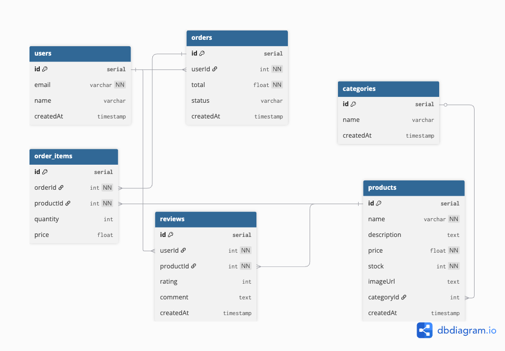

# ShopTrack: Scalable E-Commerce DB Schema

##  Overview
This project showcases the design, implementation, and documentation of a scalable and normalized database schema for a basic e-commerce platform.

## Core Tables
- **Users**
- **Products**
- **Orders**
- **Order Items**
- **Categories**
- **Reviews**
- **Payments**

## Relationships
- Users place many Orders
- Orders include many Products
- Products belong to Categories
- Users leave Reviews on Products

## Tech Stack
- PostgreSQL (hosted on Neon)
- Prisma ORM
- TypeScript (for seed script)
- Faker.js for mock data
- dbdiagram.io for ERD visualization

## Visual Data Explorer (Prisma Studio)

This project includes Prisma Studio for browsing the database visually:

## ER Diagram

## Project Structure
- `prisma/schema.prisma` – defines the full schema
- `seed.sql` – sample data for testing queries
- `docs/schema.md` – documentation on each table and its purpose

## Future Enhancements
- Add user roles (admin, customer)
- Implement API endpoints for CRUD operations
- Integrate Docker for easier deployment

## Learning Outcomes
- Real-world database modeling
- Understanding of relational schema design
- Hands-on experience with ORMs and migrations
